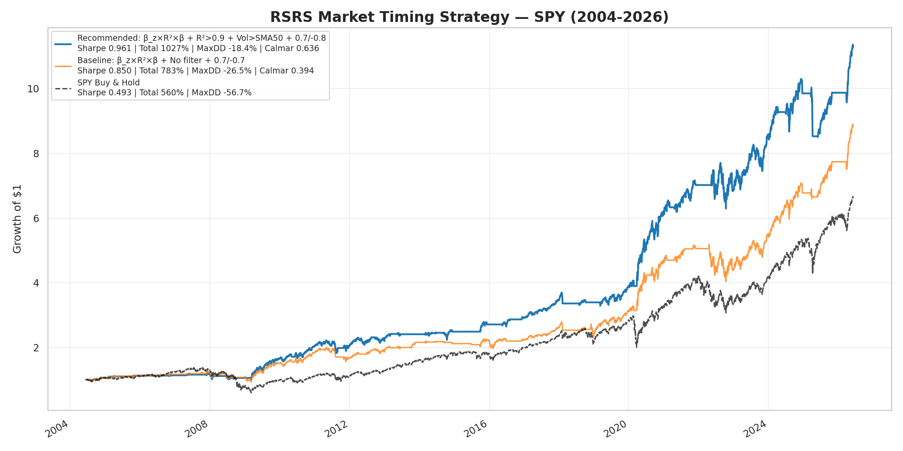
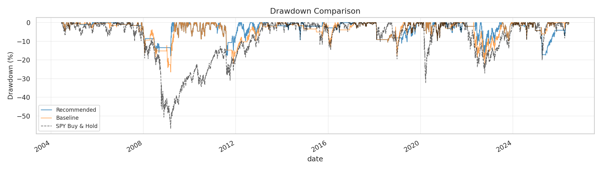
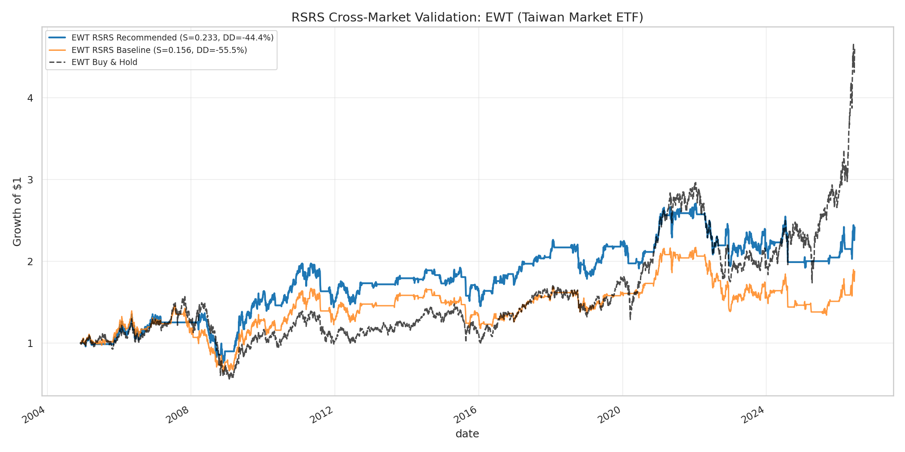
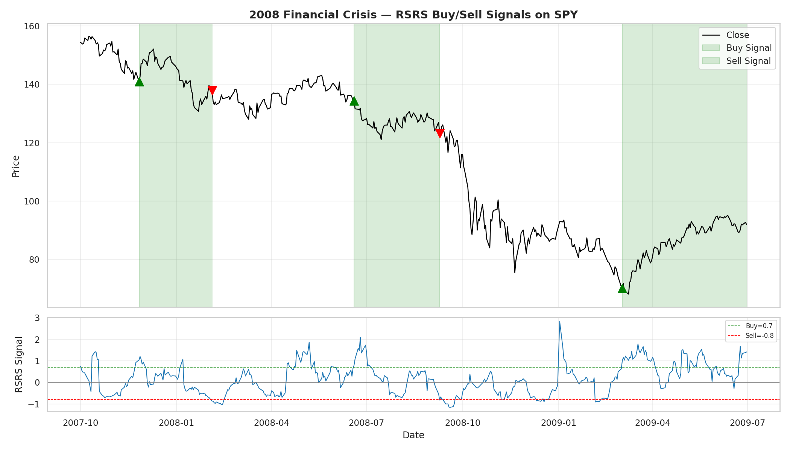
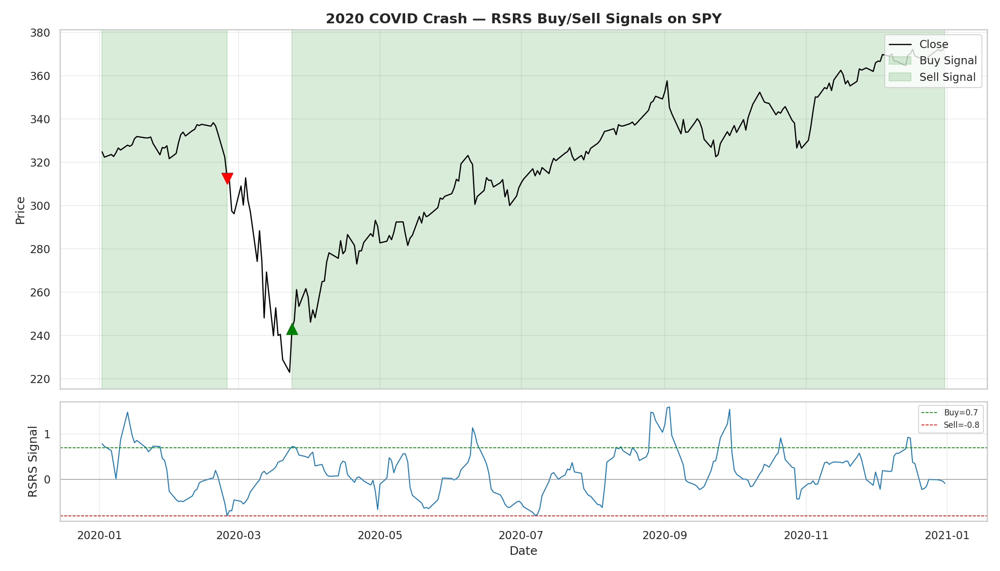

# RSRS 阻力支撐相對強度擇時策略 — NautilusTrader 復現

> 復現光大證券《基於阻力支撐相對強度(RSRS)的市場擇時》研報，  
> 以 **NautilusTrader** 框架實作回測，數據來源 **FMP**。  
> 經系統性優化（150+ 組合 + CSCV 過擬合檢驗），最終配置 SPY 上取得  
> **Sharpe 0.961 / MaxDD -18.4% / Calmar 0.636**。

**完整策略介紹請見 → [STRATEGY.md](STRATEGY.md)**

## 重點更新

- ✅ **PBO 過擬合檢驗**：誠實揭露 PBO=0.61 屬於「高過擬合風險」，並提出 Walk-Forward / 跨市場驗證 / Ensemble 三大緩解方案
- ✅ **台灣市場驗證**：將 RSRS 套用到 EWT（iShares MSCI Taiwan ETF）驗證跨市場穩健性
- ✅ **危機買賣點視覺化**：2008 金融海嘧、2020 COVID 崩盤期間的實際信號觸發點
- ✅ **多空雙向探討**：策略侈限與未來方向（做空、VIX 避險、債券輪動）

## 最終推薦配置

```
信號:     β_z × R² × β（右偏修正）
濾網:     R² > 0.9 + Volume > SMA(Volume, 50)
買入:     signal > 0.7
賣出:     signal < -0.8（不對稱）
```

| 指標 | RSRS 策略 | Buy & Hold |
|------|:---:|:---:|
| 總報酬 | **1027%** | 566% |
| Sharpe | **0.961** | 0.50 |
| 最大回撤 | **-18.4%** | -56.7% |
| Calmar | **0.636** | 0.16 |

### 權益曲線





### 台灣市場跨市場驗證



| 市場 | Sharpe | Total | MaxDD |
|------|:---:|:---:|:---:|
| SPY (Recommended) | 0.949 | 999% | -18.4% |
| EWT (Recommended) | 0.233 | 142% | -44.4% |

→ 策略邏輯跨市場有效，但參數需針對台灣市場特性重新優化

### 危機時期買賣點





## 快速開始

```bash
pip install -r requirements.txt
export FMP_API_KEY="your_key_here"

# 主回測
python backtest.py --no-volume-filter --full-capital

# 分析腳本
python compare_filters.py       # 9 種濾網比較
python threshold_search.py      # 不對稱門檻搜索
python advanced_filters.py      # 進階濾網 + 信號變體 + 因子分箱
python combo_search.py          # 150 組合搜索
python cscv_test.py             # CSCV 過擬合檢驗
python volume_ma_confirm.py     # 50 種成交量/MA 確認
python cross_market_validation.py  # 台灣市場驗證 + 危機圖表
```

## 專案結構

```
├── backtest.py              # 主回測程式（NautilusTrader 引擎）
├── rsrs_indicator.py        # RSRS 指標（OLS + Z-score + 5 種信號變體）
├── rsrs_strategy.py         # NautilusTrader 策略
├── data_loader.py           # FMP 數據載入（自動分頁）
├── compare_filters.py       # Volume/MA 濾網比較
├── threshold_search.py      # 不對稱門檻搜索
├── advanced_filters.py      # 進階濾網 + 信號變體 + 因子分箱
├── combo_search.py          # 150 組合搜索
├── cscv_test.py             # CSCV 過擬合檢驗
├── volume_ma_confirm.py     # 成交量/MA 確認濾網
├── tuned_strategy.py        # 最終配置門檻微調
├── cross_market_validation.py  # 台灣市場驗證 + 危機圖表
├── STRATEGY.md              # 完整策略文件
├── requirements.txt         # 依賴套件
└── results/                 # 回測結果（圖表、CSV）
```

## 參考

- 光大證券《基於阻力支撐相對強度(RSRS)的市場擇時》(2017)
- López de Prado (2018) — CSCV & PBO
- [NautilusTrader](https://nautilustrader.io/) / [FMP API](https://financialmodelingprep.com/)
