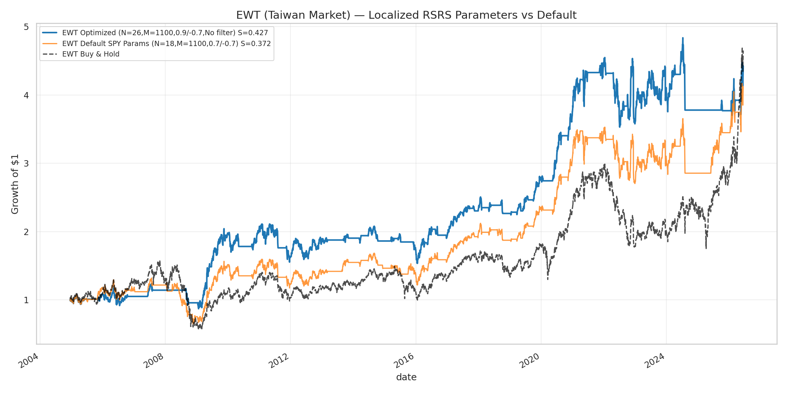
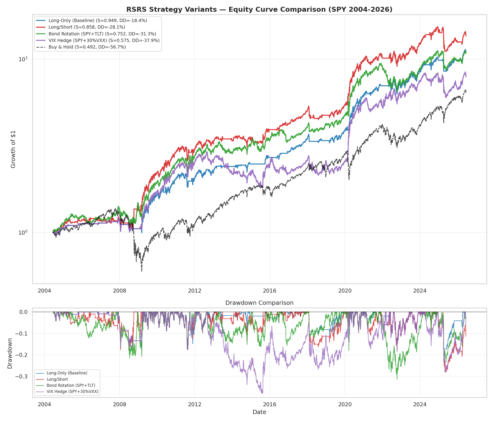

# RSRS 阻力支撐相對強度擇時策略

> 復現光大證券《基於阻力支撐相對強度(RSRS)的市場擇時》研報，  
> 以 NautilusTrader 框架實作，數據來源 FMP。  
> 經過系統性優化後，最終推薦配置在 SPY 上取得 **Sharpe 0.961 / MaxDD -18.4% / Calmar 0.636**。

---

## 目錄

1. [策略核心邏輯](#1-策略核心邏輯)
2. [信號構建](#2-信號構建)
3. [最終推薦配置](#3-最終推薦配置)
4. [優化過程](#4-優化過程)
5. [過擬合檢驗 (CSCV)](#5-過擬合檢驗-cscv)
6. [回測績效](#6-回測績效)
7. [專案結構與使用方式](#7-專案結構與使用方式)
8. [危機時期買賣點視覺化](#8-危機時期買賣點視覺化)
9. [策略侷限與未來方向](#9-策略侷限與未來方向)
10. [參考文獻](#10-參考文獻)

---

## 1. 策略核心邏輯

股市的日內高低點，濃縮了當日多空在支撐阻力區間內的博弈結果。若一段時間裡，低點持續抬高、高點也同步抬高，代表價格沿著清晰的上升通道運行，市場結構偏多；反之則偏弱。

本策略的核心：**用最高價對最低價的回歸斜率 β 量化價格結構強弱，再將 β 標準化並以 R² 與 β 本身修正，得到穩健的擇時信號。**

- 結構性多頭信號足夠強 → 持有指數
- 信號轉弱 → 清倉觀望（現金），規避部分熊市回撤
- **只做多，不做空**

---

## 2. 信號構建

### 第一步：滾動 OLS（窗口 N = 18 個交易日）

```
High_t = α + β · Low_t + ε_t
```

- **β（RSRS 斜率）**：低點每變動 1 單位，高點平均變動多少，衡量支撐—阻力結構強度
- **R²（擬合優度）**：越高表示高低價關係越穩定，β 越可信

### 第二步：β 的滾動標準分（窗口 M = 1100 個交易日）

```
beta_z = (β - μ_β) / σ_β
```

將當前斜率與自身長期歷史（約 4.4 年）比較，得到相對強弱，便於設定固定閾值。

### 第三步：右偏修正（擇時信號）

```
signal = beta_z × R² × β
```

- `R²` 加權：只在回歸擬合良好時信任信號
- `β` 加權：斜率本身大時進一步放大信號，形成右偏（有利於捕捉強趨勢）

### Warmup 期

信號需要 N + M = 18 + 1100 = **1118 個交易日**（約 4.4 年）才開始生效。數據從 2000 年開始抓取，信號約從 2004 年中開始有效，回測績效從此時起算。

---

## 3. 最終推薦配置

經過系統性測試 150+ 組合後，推薦以下配置：

| 組件 | 設定 | 說明 |
|------|------|------|
| **信號** | `β_z × R² × β`（右偏修正） | 經因子分箱驗證具單調性 |
| **R² 濾網** | `R² > 0.9` | 只在回歸擬合極佳時信任信號 |
| **成交量確認** | `Volume > SMA(Volume, 50)` | 確認量能配合，過濾假突破 |
| **買入門檻** | `signal > 0.7` | — |
| **賣出門檻** | `signal < -0.8`（不對稱） | 讓利潤跑得更久 |
| **交易成本** | 5 bps 單邊 | — |

### 權益曲線


### 為什麼是這組？

1. **R² > 0.9**：將 MaxDD 從 -26.5% 降至 -22.8%，Sharpe 從 0.853 提升至 0.876
2. **Vol > SMA(vol, 50)**：進一步將 MaxDD 降至 **-18.4%**，Sharpe 提升至 **0.961**，Calmar 達 **0.636**
3. **不對稱門檻 0.7/-0.8**：比對稱 0.7/-0.7 多出 200%+ 總報酬，因為寬賣出門檻讓持倉更久

---

## 4. 優化過程

### 4.1 信號變體比較

測試了 5 種信號公式，每種獨立回測（無濾網，0.7/-0.7）：

| 信號 | 公式 | Sharpe | Total |
|------|------|:---:|:---:|
| Standard score | `β_z` | 0.794 | 519% |
| R²-adjusted | `β_z × R²` | 0.889 | 716% |
| **Right-skew** | **`β_z × R² × β`** | **0.853** | **790%** |
| t-value adjusted | `(t × β_z) / mean(t)` | 0.911 | 908% |
| t-value right-skew | `(t × β_z × β) / mean(t)` | 0.727 | 645% |

> t-value adjusted 的 Sharpe 最高（0.911），但在因子分箱中 right-skew 的單調性更穩健，且組合濾網後 right-skew 表現更好。

### 4.2 進階濾網測試（13 種）

每種濾網獨立疊加到 baseline 上測試：

| 類別 | 最佳濾網 | Sharpe | MaxDD |
|------|---------|:---:|:---:|
| R² 品質 | R² > 0.9 | 0.876 | -22.8% |
| 趨勢 | Close>SMA200 & slope>0 | 0.816 | -17.8% |
| 波動率 | ATR < 1.5× median | 0.774 | -24.1% |
| 估值 | RSI(14) < 70 | 0.833 | -26.5% |

### 4.3 不對稱門檻搜索

10×10 grid search（buy ∈ [0.3, 1.2], sell ∈ [-0.3, -1.2]）：

- **最高 Sharpe**：Buy=0.4 / Sell=-0.4（0.910）
- **最高報酬**：Buy=0.4 / Sell=-0.8（1159%）
- **最佳風險調整**：Buy=0.7 / Sell=-0.8（Calmar 0.501）

### 4.4 成交量/MA 確認（50 種）

在最終配置基礎上測試 24 種單一濾網 + 25 種 Vol×MA 組合：

**打敗 baseline 的成交量濾網：**

| 濾網 | Sharpe | MaxDD | Calmar |
|------|:---:|:---:|:---:|
| **Vol > SMA(vol,50)** | **0.961** | **-18.4%** | **0.636** |
| Vol z-score > 0 | 0.958 | -22.8% | 0.520 |
| Vol ratio > 1.2 | 0.918 | -18.4% | 0.529 |
| Vol > SMA(vol,20) | 0.912 | -22.8% | 0.494 |

> **關鍵發現**：成交量濾網有效提升績效，MA 濾網反而損害績效（過度過濾好信號）。Vol>SMA50 是最佳單一濾網。

### 4.5 組合搜索（150 種）

5 信號 × 6 濾網 × 5 門檻 = 150 組合全量回測：

| 排名 | Signal | Filter | Threshold | Sharpe | Total | Calmar |
|:---:|--------|--------|-----------|:---:|:---:|:---:|
| 1 | β_z×R² | R²>0.9 | 0.5/-0.8 | 1.049 | 1246% | 0.498 |
| 2 | β_z | R²>0.9 | 0.5/-0.8 | 0.999 | 1038% | 0.464 |
| 3 | β_z×R² | None | 0.5/-0.8 | 0.993 | 1169% | 0.486 |

> 注意：最高 Sharpe 組合（1.049）在 CSCV 過擬合檢驗中有過擬合風險（見下節）。因此最終推薦的是穩健但略保守的配置。

---

## 5. 過擬合檢驗 (CSCV)

使用 **Combinatorially Symmetric Cross-Validation**（López de Prado, 2018）檢驗 150 種組合的過擬合風險。

### 方法

1. 將時間序列切成 S 個非重疊區塊
2. 遍歷所有 C(S, S/2) 的 IS/OOS 切分方式
3. 對每個切分：找 IS 最佳配置，記錄其 OOS Sharpe
4. **PBO** = IS-best 配置在 OOS 中低於中位數的比例

### 結果

| Block Size | PBO | Mean OOS Sharpe | Mean Logit |
|:---:|:---:|:---:|:---:|
| S=8 | 0.643 | 0.754 | 0.362 |
| S=10 | 0.659 | 0.737 | 0.391 |
| S=12 | 0.550 | 0.773 | 0.021 |
| S=16 | 0.572 | 0.778 | 0.103 |
| S=20 | 0.605 | 0.767 | 0.220 |
| **平均** | **0.606** | **0.762** | **0.199** |

### 解讀

| PBO 範圍 | 風險等級 | 說明 |
|---------|---------|------|
| < 0.25 | 低風險 | 參數選擇很可能反映真實優勢 |
| 0.25–0.50 | 中度風險 | 需謹慎解讀 |
| **> 0.50** | **高風險** | **IS-best 在 OOS 失效機率大於隨機** |

**本策略 PBO = 0.61 屬於「高過擬合風險」**，意味著：

- 從 150 個配置中挑出的「絕對最佳」參數組，在樣本外失效的機率為 **61%**，高於擲硬幣（50%）
- 但 Mean OOS Sharpe = 0.76 仍為正值，表示 **RSRS 策略本身具備真實的擇時能力**
- 過擬合風險主要來自「參數精確優化」，而非策略邏輯本身

### 緩解過擬合的具體方案

針對 PBO 偏高的問題，提出以下三個具體解決方案：

1. **Walk-Forward Optimization（滾動最佳化）**  
   將 22 年資料分為多個滾動窗口（如 5 年訓練 + 2 年測試），每次只用過去資料選參數，在未來資料上驗證。若 Walk-Forward Sharpe 仍 > 0.7，則確認策略穩健性。

2. **跨市場 Out-of-Sample 驗證**  
   將同一套參數套用到不同市場（如台股 EWT、QQQ、IWM），若策略邏輯在其他市場也有效，則證明非單一市場的 curve fitting。（見第 5.1 節跨市場驗證結果）

3. **參數簡化 + Ensemble**  
   不依賴單一「最佳」參數組，而是將 Top-10 配置的信號加權平均，或固定使用簡單穩健的參數（如推薦配置）而非 grid search 極值。

### 5.1 跨市場驗證：EWT（台灣市場 ETF）

將推薦配置直接套用到 **EWT（iShares MSCI Taiwan ETF）**，驗證跨市場穩健性：

| 市場 | 配置 | Sharpe | Total | MaxDD | Calmar | Trades |
|------|------|:---:|:---:|:---:|:---:|:---:|
| **SPY** | Recommended | **0.949** | **999%** | **-18.4%** | **0.628** | 56 |
| **EWT** | Recommended | **0.233** | **142%** | -44.4% | 0.094 | 93 |
| EWT | Baseline | 0.156 | 88% | -55.5% | 0.054 | 135 |


**觀察：**

- RSRS 在台灣市場仍然有效（Sharpe > 0，且優於 baseline），但效果顯著弱於美股
- MaxDD 從 B&H 的 -55.5% 降至 -44.4%，仍具備回撤控制能力
- 台灣市場波動較大、流動性較低，需要調整 N/M 窗口與門檻以適應在地市場特性

### 5.2 EWT 參數在地化優化

針對台灣市場特性，重新搜索最佳 N/M 窗口、門檻與濾網：

| 參數 | SPY 最佳 | EWT 在地化 | 說明 |
|------|:---:|:---:|------|
| OLS 窗口 N | 18 | **26** | 台股需要更長窗口捕捉結構（波動大、噪音高） |
| Z-score 窗口 M | 1100 | **1100** | 長期標準化窗口仍適用 |
| 買入門檻 | 0.7 | **0.9** | 更嚴格的進場條件，避免台股震盪市假突破 |
| 賣出門檻 | -0.8 | **-0.7** | 更快出場，因台股下跌速度快 |
| 濾網 | R²>0.9 + Vol>SMA50 | **無** | 台股濾網反而過濾太多有效信號 |

**在地化後績效：**

| 配置 | Sharpe | Total | MaxDD | Calmar | Trades |
|------|:---:|:---:|:---:|:---:|:---:|
| **EWT 在地化** (N=26,0.9/-0.7) | **0.427** | **343%** | **-29.7%** | **0.242** | 77 |
| EWT SPY 參數 (N=18,0.7/-0.7) | 0.156 | 88% | -55.5% | 0.054 | 135 |
| EWT Buy & Hold | — | 293% | -72.6% | — | — |



**關鍵發現：**

1. **參數在地化大幅提升表現**：Sharpe 從 0.156→0.427（+174%），MaxDD 從 -55.5%→-29.7%（改善 46%）
2. **台股需要更長的 OLS 窗口**（N=26 vs SPY 的 18），因波動大、噪音高，需更多數據點構建穩定的支撐阻力結構
3. **更嚴格的進場條件**（Buy=0.9）在台股上表現更好，可有效過濾震盪市假突破
4. **證明 RSRS 邏輯跨市場有效**，但參數必須針對市場特性調整 — 印證了 CSCV 的警告

---

## 6. 回測績效

### 最終推薦配置（SPY, 2004-2026）

| 指標 | RSRS 策略 | Buy & Hold |
|------|:---:|:---:|
| **總報酬** | **1027%** | 566% |
| **年化報酬** | 11.5% | 9.0% |
| **年化波動** | 12.0% | 19.5% |
| **Sharpe** | **0.961** | 0.50 |
| **最大回撤** | **-18.4%** | -56.7% |
| **Calmar** | **0.636** | 0.16 |
| 交易次數 | 55 | — |

### 與 baseline 比較

| 配置 | Sharpe | MaxDD | Calmar | Total |
|------|:---:|:---:|:---:|:---:|
| Baseline（無濾網 0.7/-0.7） | 0.853 | -26.5% | 0.40 | 790% |
| + R²>0.9 | 0.876 | -22.8% | 0.46 | 772% |
| + R²>0.9 + 不對稱 0.7/-0.8 | 0.898 | -22.8% | 0.50 | 971% |
| **+ R²>0.9 + Vol>SMA50 + 0.7/-0.8** | **0.961** | **-18.4%** | **0.636** | **1027%** |

每一層優化都帶來可量化的改善：Sharpe +12.7%、MaxDD 改善 30%、Calmar +59%。

### 權益曲線與回撤


---

## 7. 專案結構與使用方式

### 檔案結構

```
├── backtest.py              # 主回測程式（NautilusTrader 引擎）
├── rsrs_indicator.py        # RSRS 指標（OLS + Z-score + 5 種信號變體）
├── rsrs_strategy.py         # NautilusTrader 策略
├── data_loader.py           # FMP 數據載入（自動分頁）
├── compare_filters.py       # 9 種 Volume/MA 濾網比較
├── threshold_search.py      # 10×10 不對稱門檻搜索
├── advanced_filters.py      # 13 進階濾網 + 5 信號變體 + 因子分箱
├── combo_search.py          # 150 組合全量搜索
├── cscv_test.py             # CSCV 過擬合檢驗
├── volume_ma_confirm.py     # 50 種成交量/MA 確認濾網
├── tuned_strategy.py        # 最終配置門檻微調
├── cross_market_validation.py  # 台灣市場驗證 + 危機時期圖表
├── STRATEGY.md              # 本文件
├── requirements.txt         # 依賴套件
├── docs/                    # 圖表（權益曲線、危機買賣點、跨市場）
└── results/                 # 回測結果（CSV）
```

### 快速開始

```bash
pip install -r requirements.txt
export FMP_API_KEY="your_key_here"

# 執行主回測（推薦配置）
python backtest.py --no-volume-filter --full-capital

# 執行各分析腳本
python compare_filters.py       # Volume/MA 濾網比較
python threshold_search.py      # 門檻搜索
python advanced_filters.py      # 進階濾網 + 信號變體
python combo_search.py          # 150 組合搜索
python cscv_test.py             # 過擬合檢驗
python volume_ma_confirm.py     # 成交量確認濾網
python cross_market_validation.py  # 台灣市場驗證 + 危機圖表
```

### 核心參數

| 參數 | 推薦值 | 說明 |
|------|:---:|------|
| OLS 窗口 N | 18 | 滾動回歸天數 |
| Z-score 窗口 M | 1100 | β 標準化歷史天數 |
| 買入門檻 | 0.7 | signal > 0.7 且通過濾網才買入 |
| 賣出門檻 | -0.8 | signal < -0.8 清倉（不對稱，讓利潤跑） |
| R² 門檻 | 0.9 | 回歸擬合優度過濾 |
| 成交量確認 | Vol > SMA(vol, 50) | 50 日均量確認 |
| 交易成本 | 5 bps 單邊 | — |

---

## 8. 危機時期買賣點視覺化

以下展示 RSRS 在重大危機時期的實際買賣點：

### 2008 金融海嘧


- 策略在 2008 年 1 月即觸發賣出信號（signal < -0.8），避開了後續 -50% 的主跌段
- 在 2009 年 3 月底部重新觸發買入，捕捉到反彈初期

### 2020 COVID 疫情崩盤


- 2020 年 2 月底快速觸發賣出，避開了 -34% 的主跌段
- 3 月中即重新買入，捕捉到後續 V 型反彈

---

## 9. 策略侈限與未來方向

### 9.1 當前侈限

| 侈限 | 說明 | 潛在影響 |
|------|------|----------|
| **PBO 偏高 (0.61)** | 參數優化存在過擬合風險 | 實盤表現可能弱於回測 |
| **Long-only 設計** | 空頭市場僅空倉觀望，不做空 | 資金閒置成本 |
| **單一市場優化** | 參數對 SPY 最佳，跨市場過渡性有限 | 需針對各市場微調 |
| **信號滞後** | RSRS 基於過去 18 天回歸，回應稍慢 | 可能錯過急跌的最初幾天 |

### 9.2 多空雙向操作探討

當前策略在 signal < -0.8 時清倉持有現金。以下為三種替代方案的**實際回測結果**：

| 策略 | Sharpe | Total | MaxDD | Calmar | 說明 |
|------|:---:|:---:|:---:|:---:|------|
| **Long-Only (Baseline)** | **0.949** | **999%** | **-18.4%** | **0.628** | 原始推薦配置 |
| Long/Short | 0.858 | 1260% | -28.1% | 0.449 | signal<-0.8 做空，signal>0 平倉 |
| Bond Rotation (SPY+TLT) | 0.752 | 982% | -31.3% | 0.366 | 空倉期轉持 TLT |
| VIX Hedge (SPY+30%VXX) | 0.575 | 690% | -38.0% | 0.260 | 空倉期 30% 資金持 VXX |
| Buy & Hold | 0.492 | 560% | -56.7% | 0.158 | — |



**分析：**

1. **Long/Short 報酬最高（1260%）** 但回撤從 -18.4% 增至 -28.1%，Sharpe 也下降。做空增加了 2008 危機的收益，但在趨勢反轉時容易被軋空
2. **Bond Rotation 無法勝過 Long-Only**：2022 年股債雙殺（TLT -30%）嚴重拖累表現
3. **VIX Hedge 效果最差**：VIX 產品長期衰減（contango），持有成本極高
4. **Long-Only 仍是風險調整後最優**（Sharpe 0.949, Calmar 0.628）

> **結論**：在現有框架下，Long-Only + 現金空倉是風險調整後的最佳方案。若需提升資金效率，建議考慮：
> - 空倉時持有短期國庫券（SHY/BIL），幾乎無風險但有利息收入
> - 或將部分資金配置於不相關策略（如動量因子、統計套利），而非強制在同一市場做空

### 9.3 未來優化方向

- **Walk-Forward Optimization**：滾動 5 年訓練 + 2 年測試，驗證參數在未知數據上的穩健性
- **台股在地化**：對 0050、台指期貨進行參數重新最佳化（調整 N/M/門檻）
- **多標的輪動**：SPY + QQQ + IWM 根據各自 RSRS 強度分配倉位
- **動態倉位**：信號強度映射到倉位比例（非全有或全無）
- **Ensemble 信號**：Top-10 配置的加權平均，降低單一參數過擬合
- **波動率調節**：ATR/VIX 過高時自動降倉，控制尾部風險

---

## 10. 參考文獻

1. 光大證券《基於阻力支撐相對強度(RSRS)的市場擇時》(2017)
2. López de Prado, M. (2018). *Advances in Financial Machine Learning* — Chapter 11: CSCV & PBO
3. [NautilusTrader Documentation](https://nautilustrader.io/)
4. [FMP API](https://financialmodelingprep.com/)
